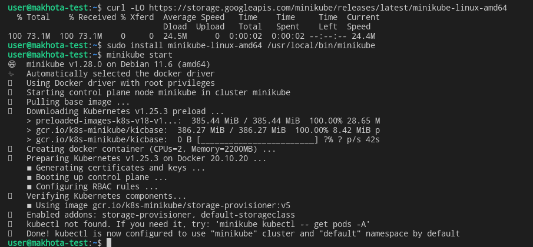

# Домашнее задание к занятию «6.5. Kubernetes. Часть 1» - `Елена Махота`

- [Ответ к Заданию 1](#1) 
- [Ответ к Заданию 2](#2) 
- [Ответ к Заданию 3](#3) 
- [Ответ к Заданию 4*](#4) 

---

### Задание 1

**Выполните действия:**

1. Запустите Kubernetes локально, используя k3s или minikube на свой выбор.
2. Добейтесь стабильной работы всех системных контейнеров.
3. В качестве ответа пришлите скриншот результата выполнения команды kubectl get po -n kube-system.

### *<a name="1"> Ответ к Заданию 1</a>*

1.

```bash
#To install the latest minikube stable release on x86-64 Linux using binary download:

curl -LO https://storage.googleapis.com/minikube/releases/latest/minikube-linux-amd64
sudo install minikube-linux-amd64 /usr/local/bin/minikube

minikube start

```

------
### Задание 2


Есть файл с деплоем:

```
---
apiVersion: apps/v1
kind: Deployment
metadata:
  name: redis
spec:
  selector:
    matchLabels:
      app: redis
  replicas: 1
  template:
    metadata:
      labels:
        app: redis
    spec:
      containers:
      - name: master
        image: bitnami/redis
        env:
         - name: REDIS_PASSWORD
           value: password123
        ports:
        - containerPort: 6379
```

------
**Выполните действия:**

1. Измените файл с учётом условий:

 * redis должен запускаться без пароля;
 * создайте Service, который будет направлять трафик на этот Deployment;
 * версия образа redis должна быть зафиксирована на 6.0.13.

2. Запустите Deployment в своём кластере и добейтесь его стабильной работы.
3. В качестве решения пришлите получившийся файл.

### *<a name="2"> Ответ к Заданию 2</a>*


------
### Задание 3

**Выполните действия:**

1. Напишите команды kubectl для контейнера из предыдущего задания:

 - выполнения команды ps aux внутри контейнера;
 - просмотра логов контейнера за последние 5 минут;
 - удаления контейнера;
 - проброса порта локальной машины в контейнер для отладки.

2. В качестве решения пришлите получившиеся команды.


### *<a name="3"> Ответ к Заданию 3</a>*

------
## Дополнительные задания* (со звёздочкой)

Их выполнение необязательное и не влияет на получение зачёта по домашнему заданию. Можете их решить, если хотите лучше разобраться в материале.

---

### Задание 4*

Есть конфигурация nginx:

```
location / {
    add_header Content-Type text/plain;
    return 200 'Hello from k8s';
}
```

**Выполните действия:**

1. Напишите yaml-файлы для развёртки nginx, в которых будут присутствовать:

 - ConfigMap с конфигом nginx;
 - Deployment, который бы подключал этот configmap;
 - Ingress, который будет направлять запросы по префиксу /test на наш сервис.

2. В качестве решения пришлите получившийся файл.

### *<a name="4"> Ответ к Заданию 4*</a>*

