# Домашнее задание к занятию «6.5. Kubernetes. Часть 1» - `Елена Махота`

- [Ответ к Заданию 1](#1) 
- [Ответ к Заданию 2](#2) 
- [Ответ к Заданию 3](#3) 
- [Ответ к Заданию 4*](#4) 

---

### Задание 1

**Выполните действия:**

1. Запустите Kubernetes локально, используя k3s или minikube на свой выбор.
2. Добейтесь стабильной работы всех системных контейнеров.
3. В качестве ответа пришлите скриншот результата выполнения команды kubectl get po -n kube-system.

### *<a name="1"> Ответ к Заданию 1</a>*

1.

```bash
#To install the latest minikube stable release on x86-64 Linux using binary download:

curl -LO https://storage.googleapis.com/minikube/releases/latest/minikube-linux-amd64
sudo install minikube-linux-amd64 /usr/local/bin/minikube

minikube start

```


2-3.

```bash
# make your life easier by adding the following to your shell config:

alias kubectl="minikube kubectl --"

# Проверка работы системных контейнеров

kubectl get po -n kube-system

```

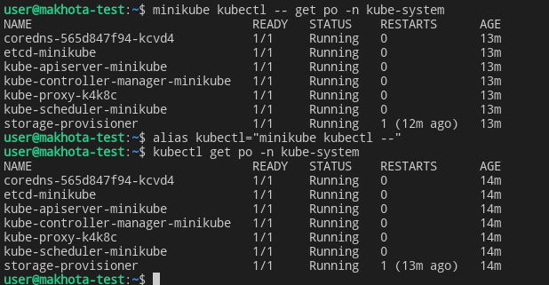


------
### Задание 2


Есть файл с деплоем:

```
---
apiVersion: apps/v1
kind: Deployment
metadata:
  name: redis
spec:
  selector:
    matchLabels:
      app: redis
  replicas: 1
  template:
    metadata:
      labels:
        app: redis
    spec:
      containers:
      - name: master
        image: bitnami/redis
        env:
         - name: REDIS_PASSWORD
           value: password123
        ports:
        - containerPort: 6379
```

------
**Выполните действия:**

1. Измените файл с учётом условий:

 * redis должен запускаться без пароля;
 * создайте Service, который будет направлять трафик на этот Deployment;
 * версия образа redis должна быть зафиксирована на 6.0.13.

2. Запустите Deployment в своём кластере и добейтесь его стабильной работы.
3. В качестве решения пришлите получившийся файл.

### *<a name="2"> Ответ к Заданию 2</a>*

[mydeployment.yml](mydeployment.yml)

```yaml
apiVersion: apps/v1
kind: Deployment
metadata:
  name: redis
spec:
  selector:
    matchLabels:
      app: redis
  replicas: 1
  template:
    metadata:
      labels:
        app: redis
    spec:
      containers:
      - name: master
        image: redis:6.0.13
        ports:
        - containerPort: 6379
```
[myservice.yml](myservice.yml)

```yaml
apiVersion: v1
kind: Service
metadata:
  name: redis
spec:
  type: ClusterIP
  ports:
  - port: 6379
    targetPort: 6379
    name: redis
  selector:
    app: redis
```

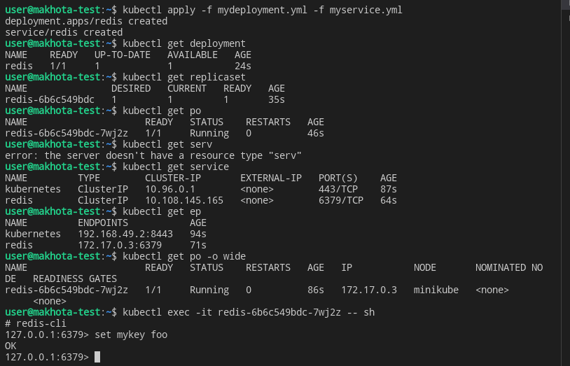

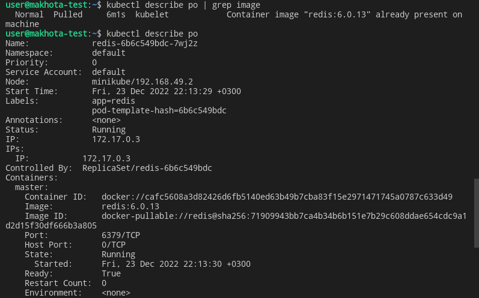


------
### Задание 3

**Выполните действия:**

1. Напишите команды kubectl для контейнера из предыдущего задания:

 - выполнения команды ps aux внутри контейнера;
 - просмотра логов контейнера за последние 5 минут;
 - удаления контейнера;
 - проброса порта локальной машины в контейнер для отладки.

2. В качестве решения пришлите получившиеся команды.

### *<a name="3"> Ответ к Заданию 3</a>*


```bash
# на хосте
kubectl exec -it redis-6b6c549bdc-7wj2z -- sh

# в контейнере
apt-get update && apt-get install procps
ps aux
```

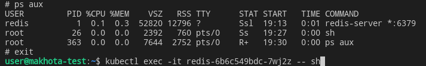


```bash
kubectl logs redis-6b6c549bdc-7wj2z
```

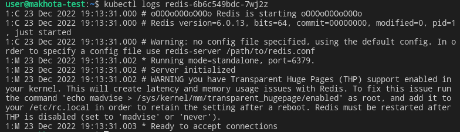


```bash
kubectl delete pod redis-6b6c549bdc-7wj2z
kubectl delete deployment redis
kubectl delete all --all
```

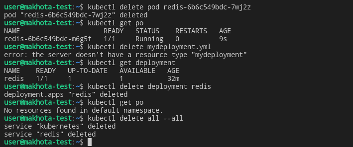

```bash
# Проброс порта

kubectl port-forward redis-6b6c549bdc-zkdp6 6379:6379

```
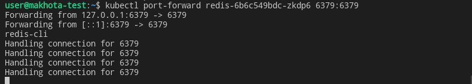


Проверка показала, что при установке ключей на хосте 127.0.0.1:6379, они сохраняются в контейнер:

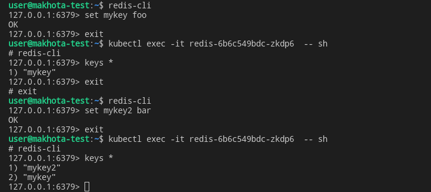

------
## Дополнительные задания* (со звёздочкой)

Их выполнение необязательное и не влияет на получение зачёта по домашнему заданию. Можете их решить, если хотите лучше разобраться в материале.

---

### Задание 4*

Есть конфигурация nginx:

```
location / {
    add_header Content-Type text/plain;
    return 200 'Hello from k8s';
}
```

**Выполните действия:**

1. Напишите yaml-файлы для развёртки nginx, в которых будут присутствовать:

 - ConfigMap с конфигом nginx;
 - Deployment, который бы подключал этот configmap;
 - Ingress, который будет направлять запросы по префиксу /test на наш сервис.

2. В качестве решения пришлите получившийся файл.

### *<a name="4"> Ответ к Заданию 4*</a>*

Информация с сайта: https://kubernetes.io/docs/tasks/access-application-cluster/ingress-minikube/

Смотрим список addons для minikube

```bash

minikube addons list

```

Включаем контроллер ingress в minikube

```bash
#To enable the NGINX Ingress controller, run the following command:

minikube addons enable ingress

```

Создаем манифесты

[configmap.yml](configmap.yml)

```yaml

apiVersion: v1
kind: ConfigMap
metadata:
  name: nginx-conf
data:
  nginx.conf: |
    server {
      listen                  80;
      server_name             _;
      location / {
          add_header Content-Type text/plain;
          return 200 'Hello from k8s, $hostname\n';
      }
    }

```


[nginx.yaml](nginx.yaml)


```yaml

apiVersion: apps/v1
kind: Deployment
metadata:
  name: nginx-deployment
  labels:
    app: nginx
spec:
  replicas: 3
  selector:
    matchLabels:
      app: nginx
  template:
    metadata:
      labels:
        app: nginx
    spec:
      containers:
      - name: nginx
        image: nginx:1.12
        ports:
          - containerPort: 80
        volumeMounts:
        - name: nginx-conf
          mountPath: /etc/nginx/conf.d
      volumes:
      - name: nginx-conf
        configMap:
          name: nginx-conf

```

[nginx-service.yaml](nginx-service.yaml)

```yaml

apiVersion: v1
kind: Service
metadata:
  name: nginx-service
spec:
  selector:
    app: nginx
  ports:
    - protocol: TCP
      port: 80
      targetPort: 80
  type: ClusterIP

```

[ingress.yml](ingress.yml)

```yaml

apiVersion: networking.k8s.io/v1
kind: Ingress
metadata:
  name: nginx-ingress
  annotations:
      nginx.ingress.kubernetes.io/rewrite-target: /$1
spec:
  rules:
    - host: nginx.info
      http:
        paths:
          - path: /
            pathType: Prefix
            backend:
              service:
                name: nginx-service
                port:
                  number: 80

```

Cоздаем и смотрим созданные объекты

```bash

kubectl apply -f configmap.yml -f nginx.yaml -f nginx-service.yaml -f ingress.yml
kubectl get deployment
kubectl get replicaset
kubectl get po
kubectl get service
kubectl get ep
kubectl get ingress

```

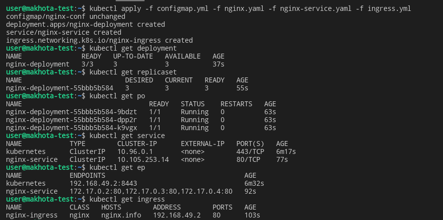


Добавляем в `/etc/hosts` адрес и имя хоста, указанное в [ingress.yml](ingress.yml)

```bash
nano ingress.yml
192.168.49.2 nginx.info
```

Проверяем доступность нашего сайта

```bash
curl nginx.info
```

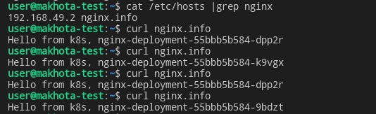


Чтобы запросы шли по префиксу /test на наш сервис исправляем [ingress.yml](ingress.yml)

```yaml
 paths:
          - path: /test
            pathType: Prefix

```

Применяем изменения [ingress.yml](ingress.yml) и перезапускаем поды

```bash
kubectl apply -f ingress.yml
kubectl rollout restart deployment nginx-deployment
```

Теперь наш сайт не доступен по адресу `nginx.info`, но доступен по адресу `nginx.info/test` с префиксом, видим, что [service](nginx-service.yaml) чередует наши контейнеры при обращении к сайту, рапределяя нагрузку на кластер миникуба.

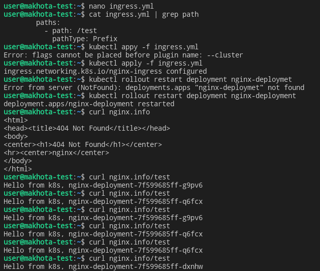